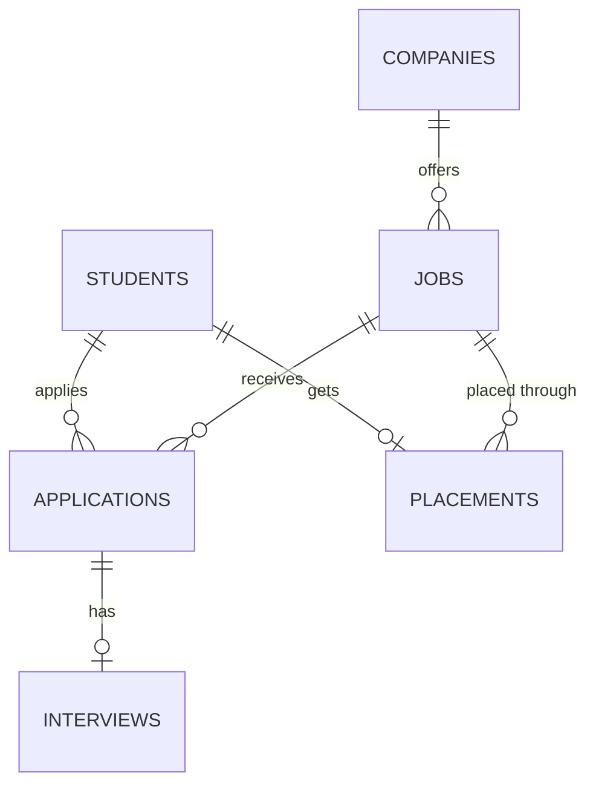

# College Placement Management System

A Java application that manages the college placement process end to end: student registration, company and job postings, eligibility filtering, applications, interview scheduling, selection and placement reports. It is built with **Core Java, JDBC and MySQL** and follows a layered architecture (Model, DAO, Service, UI).

> The current version has a **console (menu-driven) interface**. A Java Swing desktop UI is planned (see [Future Enhancements](#future-enhancements)).

---

## Table of Contents

- [Features](#features)
- [Tech Stack](#tech-stack)
- [Architecture](#architecture)
- [Project Structure](#project-structure)
- [Database Design](#database-design)
- [How Eligibility Works](#how-eligibility-works)
- [Application Status Lifecycle](#application-status-lifecycle)
- [Getting Started](#getting-started)
- [Default Login Credentials](#default-login-credentials)
- [Usage Walkthrough](#usage-walkthrough)
- [Testing Checklist](#testing-checklist)
- [Security and Validation](#security-and-validation)
- [Known Limitations](#known-limitations)
- [Future Enhancements](#future-enhancements)
- [Author](#author)

---

## Features

### Student module
- Register and log in
- View and update profile (department, CGPA, backlogs, skills, phone)
- View all available jobs, and the jobs they are **eligible** for
- Apply for eligible jobs (duplicate applications are blocked)
- Track application status and interview details

### Company module
Companies are managed by the placement officer (admin):
- Add, update and delete company details
- Add jobs with role, package, minimum CGPA, maximum backlogs, allowed departments and required skills
- Update eligibility criteria of a job
- View all applicants of a job

### Admin / Placement Officer module
- Add, search, update and delete students
- Manage companies and jobs
- Filter the students eligible for a job
- View applications by status and update them (Applied, Shortlisted, Rejected)
- Schedule interviews (date, time, venue or mode) and record results
- Final selection, which creates a placement record
- View placement records
- Reports: placed vs unplaced, unplaced student list, company-wise and department-wise placements, highest / average / lowest package

---

## Tech Stack

| Layer | Technology |
|---|---|
| Language | Java 17 or later (Core Java, OOP, Collections, Exception Handling) |
| Database access | JDBC with `PreparedStatement` |
| Database | MySQL 8 |
| Driver | MySQL Connector/J |
| IDE | Eclipse (any Java IDE works) |

---

## Architecture

```
Main (console UI)
   |
Service layer   -> business rules (eligibility, apply, interview, selection)
   |
DAO layer       -> all SQL queries (JDBC)
   |
MySQL database
```

- **Model**: plain Java classes that represent table rows (`Student`, `Company`, `Job`, `Application`).
- **DAO**: Data Access Objects. Each one holds the SQL for one area.
- **Service**: business logic that combines several DAOs.
- **Util**: database connection, password hashing, input validation, a small helper for read-only reports.

---

## Project Structure

```
Placement_System/
├── src/
│   ├── main/
│   │   └── Main.java                 # console menus (admin, student, registration)
│   ├── model/
│   │   ├── Student.java
│   │   ├── Company.java
│   │   ├── Job.java
│   │   └── Application.java
│   ├── dao/
│   │   ├── StudentDAO.java
│   │   ├── CompanyDAO.java
│   │   ├── JobDAO.java
│   │   ├── ApplicationDAO.java
│   │   ├── InterviewDAO.java
│   │   ├── PlacementDAO.java
│   │   ├── AdminDAO.java
│   │   └── ReportDAO.java            # JOIN views and reports
│   ├── service/
│   │   ├── EligibilityService.java
│   │   ├── ApplicationService.java
│   │   └── PlacementService.java
│   └── util/
│       ├── DBConnection.java
│       ├── PasswordUtil.java         # SHA-256 hashing
│       ├── Validator.java
│       └── QueryUtil.java
├── database/
│   └── schema.sql                    # tables, default admin, sample data
└── README.md
```

---

## Database Design

### ER diagram



### Tables

| Table | Purpose | Key columns |
|---|---|---|
| `students` | Student profiles and login | student_id, name, email (unique), password (hash), phone, department, cgpa, backlogs, skills |
| `companies` | Recruiting companies | company_id, name, location, contact |
| `jobs` | Job openings and eligibility criteria | job_id, company_id (FK), role, package_lpa, min_cgpa, max_backlogs, allowed_departments, required_skills |
| `applications` | A student applying to a job | application_id, student_id (FK), job_id (FK), status, applied_date. `UNIQUE(student_id, job_id)` |
| `interviews` | Interview schedule and result | interview_id, application_id (FK, unique), interview_date, interview_time, venue, result |
| `placements` | Final placement records | placement_id, student_id (FK, unique), job_id (FK), package_lpa, placed_date |
| `admin` | Placement officer login | admin_id, username (unique), password (hash) |

The `UNIQUE` constraints and foreign keys protect the data at the database level, in addition to the checks in Java:
- a student cannot apply to the same job twice
- an application can have only one interview
- a student can have only one placement
- a company with jobs, or a student with applications, cannot be deleted by mistake

---

## How Eligibility Works

A student is eligible for a job only if **all four** rules pass:

1. Student CGPA is **greater than or equal to** the job's minimum CGPA
2. Student backlogs are **less than or equal to** the job's maximum backlogs
3. Student department is in the job's allowed departments (an empty list means no restriction)
4. Student has **all** of the job's required skills

Departments and skills are stored as comma-separated text. They are split, trimmed and compared case-insensitively, so `"java, SQL"` matches `"Java,sql"`.

The logic lives in `EligibilityService` and is used in two places: filtering eligible students for the admin, and blocking ineligible students from applying.

---

## Application Status Lifecycle

```
Applied -> Shortlisted -> Interview Scheduled -> Selected
                 \                  \
                  +---------------> Rejected
```

- Scheduling an interview moves the application to **Interview Scheduled**.
- A **Failed** interview result moves it to **Rejected**.
- **Selected** can only be set through the final selection option, which also creates the placement record.

---

## Getting Started

### Prerequisites

- JDK 17 or later
- MySQL Server 8 and MySQL Workbench
- MySQL Connector/J (JDBC driver JAR)
- Eclipse or any Java IDE

### 1. Clone the repository

```bash
git clone https://github.com/<your-username>/<your-repo>.git
```

### 2. Create the database

Open MySQL Workbench, then open and run `database/schema.sql`. It creates the `placement_db` database, all tables, the default admin and a few sample records.

### 3. Configure the connection

Open `src/util/DBConnection.java` and set your MySQL details:

```java
private static final String URL="jdbc:mysql://localhost:3306/placement_db";
private static final String USER="root";
private static final String PASSWORD="your_mysql_password";
```

> Never commit your real password to GitHub.

### 4. Add the JDBC driver

Download **MySQL Connector/J** and add the JAR to the project:
Right-click project, **Build Path**, **Configure Build Path**, **Libraries**, **Classpath**, **Add External JARs**, then choose `mysql-connector-j-x.x.x.jar`.

### 5. Run

Run `src/main/Main.java` as a Java Application. The menu appears in the console.

---

## Default Login Credentials

| Role | Username / Email | Password |
|---|---|---|
| Admin | `admin` | `admin123` |
| Student (sample) | `arun@gmail.com` | `pass123` |
| Student (sample) | `priya@gmail.com` | `pass123` |
| Student (sample) | `kavin@gmail.com` | `pass123` |

Change the admin password before any real use.

---

## Usage Walkthrough

A full placement cycle using the sample data:

1. Log in as a student (`arun@gmail.com`) and choose **Apply for a job**. Only eligible jobs are listed.
2. Log in as admin and choose **View applicants of a job**.
3. **Update application status** to **Shortlisted**.
4. **Schedule interview** with a date (`yyyy-mm-dd`), time (`HH:mm`) and venue.
5. **Record interview result** as **Passed**.
6. **Select student**. This marks the application **Selected** and creates the placement record.
7. Open **Reports** to see the placement summary, company-wise and department-wise counts and package statistics.

---

## Testing Checklist

| Area | Test | Expected result |
|---|---|---|
| Connection | Run the app | Menu appears with no errors |
| Registration | Invalid email, 9-digit phone, CGPA 11, duplicate email | Each is rejected with a message |
| Registration | Valid details | "Registered successfully"; stored password is a 64-character hash |
| Login | Wrong password | "Invalid email or password" |
| Student CRUD | Add, search, update (Enter keeps old value), delete | Each works; deleting a student with applications is blocked |
| Company and job | Add, update criteria, delete company that has jobs | Works; last one is blocked |
| Eligibility | View eligible students for job 1 (sample data) | Only Arun is eligible |
| Apply | Apply twice / ineligible student / unknown job | "Already applied" / "Not eligible" / "Job not found" |
| Status | Try to set **Selected** from the status menu | Blocked; use final selection |
| Interview | Invalid date, or scheduling twice for one application | Error message |
| Interview | Result **Failed** | Application becomes **Rejected** |
| Selection | Select a student twice | "Student is already placed" |
| Reports | After one placement | Counts, company-wise, department-wise and package stats match the database |
| Input | Type letters where a number is expected | Prompt repeats, no crash |

---

## Security and Validation

- Passwords are stored as **SHA-256 hashes**, never as plain text.
- All SQL uses **PreparedStatement**, which prevents SQL injection.
- Input validation: non-empty fields, valid email format, 10-digit phone, CGPA between 0 and 10, non-negative backlogs.
- Date and time formats are validated before being saved.
- Database constraints (unique keys and foreign keys) act as a second layer of protection.

---

## Known Limitations

- Console interface only; the password is visible while typing in the IDE console.
- SHA-256 without a salt is used for simplicity. A production system should use bcrypt or Argon2.
- Companies do not have their own login; the placement officer manages them.
- Final selection and status updates are separate database operations without a transaction.

---

## Future Enhancements

- Java Swing desktop UI (login screen, dashboards, tables)
- Company login with its own view of applicants
- Salted password hashing (bcrypt)
- Export reports to PDF or Excel
- Email notification for interview schedules
- Resume upload for students

---

## Author

**Vijaya Arun S**
BTech Artificial Intelligence and Data Science
LinkedIn: `https://www.linkedin.com/in/vijayaarun123/`
